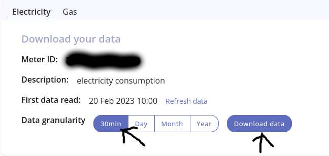

# Power Analysis DCC Glow/Bright
### How To Use:
##### 1)
Export your Hildebrand Bright/Glow data by:
visiting https://glowmarkt.com/pages/property/energy-data,
choosing 30 minutes for granularity,
and hitting download.

#### 2)
Copy the downloaded CSV to the same folder as this repo and rename it to "hildebrand_output.csv".
#### 3)
Run each Python file in order and filling in any questions:
1) `1_strip_year.py` and answer the question(s): `What year would you like to strip down to?`
2) `2_remove_outliers.py` (no other input needed)
3) `3_final_average.py` (no other input needed)
#### 4)
Then just open `final_weekday_averages.csv` in your standard spreadsheet editor (google docs, excel, libreoffice, etc).

#### Now What to Do?
Now you can do anything with this data.
ie: Use our Calculator Template to compare the cost between suppliers.

## why
because i (seb) am getting a new ev and ev charger (well i mean my parents are) and need to know what tarrif is best for our energy usage and for charging my (parents) new car.

## how
stop asking questions and run the damn scripts.

## example output
| Day | Avg. Day Use (kWh) | Avg. Night Use (Midnight-5AM) (kWh)
|---|---|---|
Monday | 0.295 | 0.194
Tuesday | 0.274 | 0.198
Wednesday | 0.306 | 0.189
Thursday | 0.31 | 0.194
Friday | 0.307 | 0.196
Saturday | 0.353 | 0.194
Sunday | 0.342 | 0.201

this is exported as a `.csv` file which most spreadsheet apps can read.
PS: this is actually my final data after running my glow export through these scripts.